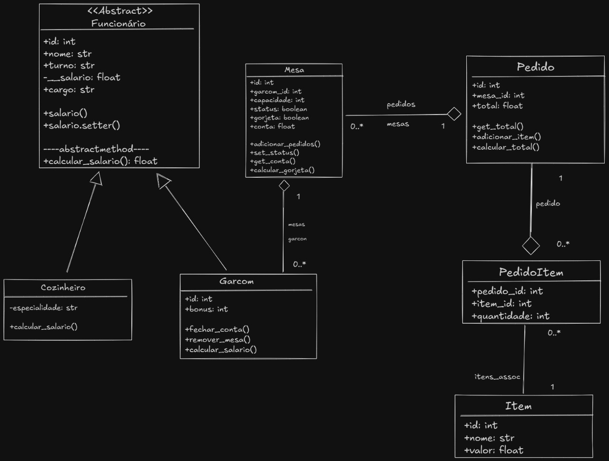

# Sistema de Gerenciamento de Restaurante



Projeto desenvolvido para a matéria de **_Programação Orientada a Objetos_**, implementando um sistema completo de gerenciamento para restaurantes.

## 📝 Descrição

Este é um sistema de gerenciamento de restaurante desenvolvido em **Python**, utilizando **SQLAlchemy** como ORM (Mapeamento Objeto-Relacional) e uma interface via **linha de comando (CLI)**. O sistema permite o gerenciamento completo das operações básicas de um restaurante, incluindo gestão de funcionários, mesas, pedidos e muito mais.

## 👥 Equipe

- **Ana Laura Brandão** (RA: 2402680)
- **Gustavo Bomfim** (RA: 2403139)
- **João Victor França** (RA: 2402779)
- **Gabriel Gonçalves** (RA: 2402912)

## 🛠️ Tecnologias Utilizadas

- **Python 3.x**: Linguagem de programação principal
- **SQLite**: Sistema de gerenciamento de banco de dados
- **SQLAlchemy**: Framework ORM para Python
- **CLI**: Interface de linha de comando para interação com o usuário

## 📁 Estrutura do Projeto

```
restaurante/
├── main.py           # Arquivo principal com a interface CLI
├── database.py       # Configuração do banco de dados
├── createdb.py       # Script para criação inicial do banco
├── classes/          # Módulo com as classes do sistema
│   ├── funcionario.py
│   ├── garcom.py
│   ├── cozinheiro.py
│   ├── mesa.py
│   └── pedido.py
└── restaurante.db    # Banco de dados SQLite
```

## ⚙️ Funcionalidades

### 1. Gestão de Funcionários
- Cadastro, consulta, atualização e remoção de funcionários
- Tipos de funcionários:
  - Garçom: Responsável pelo atendimento e gestão de pedidos
  - Cozinheiro: Responsável pelo preparo dos pratos

### 2. Gestão de Mesas
- Cadastro e controle de mesas do restaurante
- Status de ocupação
- Associação com pedidos e garçons

### 3. Gestão de Pedidos
- Criação e acompanhamento de pedidos
- Associação com mesa e garçom
- Status do pedido (em preparo, pronto, entregue)

## 📋 Pré-requisitos

- Python 3.x instalado
- Pip (gerenciador de pacotes do Python)
- SQLite3

## 🚀 Instalação e Execução

1. Clone o repositório ou baixe os arquivos do projeto

2. Entre no diretório do projeto:
```bash
cd restaurante
```

3. Crie e configure o banco de dados:
```bash
python createdb.py
```

4. Inicie o sistema:
```bash
python main.py
```

## 📖 Guia de Uso

### Menu Principal
O sistema apresenta um menu interativo com as seguintes opções:
1. Gestão de Funcionários
2. Gestão de Mesas
3. Gestão de Pedidos
4. Sair

### Operações Básicas
Cada módulo (Funcionários, Mesas, Pedidos) possui as seguintes operações:
- Cadastrar (Create)
- Consultar (Read)
- Atualizar (Update)
- Remover (Delete)

## 🗄️ Estrutura do Banco de Dados

### Tabelas Principais:
1. **Funcionario**
   - ID (PK)
   - Nome
   - CPF
   - Cargo
   - Salário

2. **Mesa**
   - ID (PK)
   - Número
   - Status
   - Capacidade

3. **Pedido**
   - ID (PK)
   - Mesa_ID (FK)
   - Garcom_ID (FK)
   - Status
   - Data/Hora
   - Valor Total

## 🤝 Contribuição

Este é um projeto acadêmico desenvolvido como parte da avaliação da disciplina de Programação Orientada a Objetos. Contribuições e sugestões são bem-vindas através de issues ou pull requests.

## 📄 Licença

Este projeto é para fins educacionais e está disponível sob a licença MIT.
